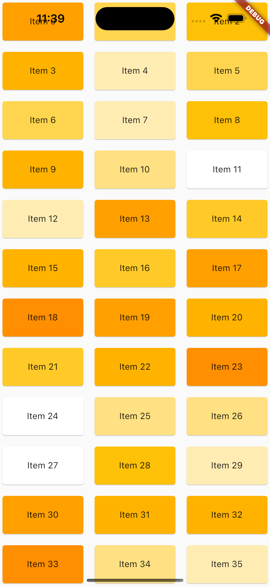

# app_akademie_sliver_test

Aufgabe zum Thema SliverGrid/SliverList.

# Aufgabe 1
Beschreibe was der Unterschied zwischen der traditionellen ListView und einer SliverList ist. Was sind Vor- und Nachteile?

Antwort:

# Aufgabe 2
Erstelle eine Oberfläche die folgendermaßen aussieht (in main2.dart):

Beachte dabei folgendes:

- Nutze die Sliver Familie (SliverList, SliverGrid etc.)
- Achte auf die Farbverteilung der einzelnen Kacheln im Grid (Farbe ist egal, Farbverteilung sollte in ähnlicher weise vertreten sein)

# Aufgabe 3
In main3.dart befindet sich eine AppBar, die nicht dem entspricht was in der Aufnahme angezeigt wird. Baue die AppBar so um, damit sich ein gleiches/ähnliches Scrollverhalten aufweist.

Tipp: 
- Nutze SliverAppBar